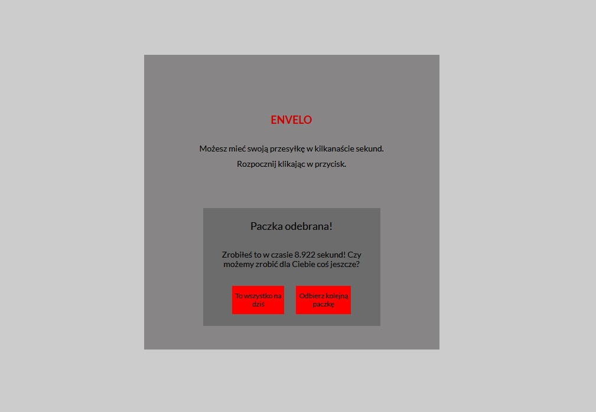

# Frontend Mentor - Newsletter sign-up form with success message

## Developed with

- HTML
- CSS
- JS

## About

This is an application that I created as an assignment, which I additionally got
from my wonderful mentor Malgorzata Kowacka :heart: The content of the
assignment was: "It's time for us to see you in action. Imagine that the Polish
Post Office is launching parcel machines and we need proof of concept screens
for receiving parcels. Since this is a PoC the mock-up is illustrative and
focuses on functionality. [...] Use PromiseAPI, setTimeout and a Math object for
this. I ditched the Math.random() and prepared a .json file to make the
application work not randomly, but for specific phone numbers and codes.
